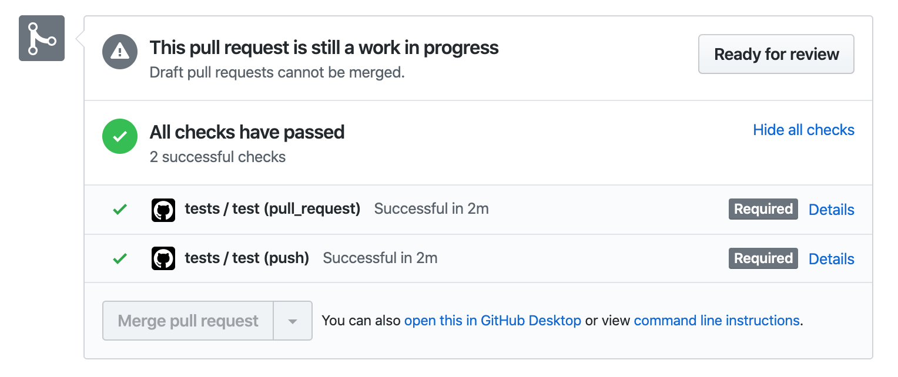

Objectives: trackable and revertible releases, a quick feedback loop, minimize regression bugs.

To achieve the aforementioned objectives, we're going to create a CI pipeline for automated build and distribution, keep a human-readable `changelog`, set up [react-native-code-push](https://github.com/Microsoft/react-native-code-push) for production hotfixes and run unit tests and e2e tests on push.

## 1. Set up Continuous Integration
We are using [git flow](https://nvie.com/posts/a-successful-git-branching-model/) as branching model. You can read more by following the link, but right now we care about 3 branches - `develop`, `master` and `release/*`.

### develop
Always contains the complete application code, even if the team is working on multiple `release/*` branches in parallel - which can often happen.

As a side note, let's say we're working on the `v1.0.0` release. We create the `release/1.0.0` branch from `develop`. All subsequent hotfixes or feature enhancements for `v1.0.0` start from `release/1.0.0` and end up back in `release/1.0.0`, but they also must be merged back to `develop` - to satisfy the above statement. To automate this, we can write a Github workflow that creates a pull request to `develop` on every push to a `release/*` branch.

```yml
# .github/workflows/keep-develop-updated.yml

name: Create release/* to develop pull request

on:
  push:
    branches:
      - release/*

jobs:
  releaseToDevelop:
    runs-on: ubuntu-latest
    steps:
      - uses: actions/checkout@v2
        with:
          ref: develop
      - name: Extract branch name
        shell: bash
        run: echo "##[set-output name=branch;]$(echo ${GITHUB_REF#refs/heads/})"
        id: extract_branch
      - name: Reset release/* branch
        run: |
          git fetch origin ${{ steps.extract_branch.outputs.branch }}:${{ steps.extract_branch.outputs.branch }}
          git reset --hard ${{ steps.extract_branch.outputs.branch }}
      - name: Create Pull Request
        uses: peter-evans/create-pull-request@v2
        with:
          title: Merge ${{ steps.extract_branch.outputs.branch }} to develop
          labels: automated-pr
          branch: ${{ steps.extract_branch.outputs.branch }}-develop
```

### master
Contains the latest production code and has [tags](https://git-scm.com/book/en/v2/Git-Basics-Tagging) for every version that was ever released. A good tag name follows [semver](https://semver.org/) - `v1.0.0` - but we can also have pre-release tags, as we'll see a bit later when we get to `code-push`.

The `master` branch is the stable version of our application.

### release/*
The `release/*` branch is **the only branch from where new builds can be created**. Never build from `develop|master`.

The build server is set up to build on every push to a `release/*` branch, with the specified environment. This means creating `staging` builds by default and only switching to a `production` configuration when the build is ready to go live.

Continuing on our `v1.0.0` example, when `v1.0.0` ends up in production, we tag the latest commit, then merge `release/1.0.0` to `master` and `develop`. Now that that latest production code is in `master`, we can safely delete the `release/1.0.0` branch.

## 2. Keep a changelog
Doing the build-on-push process from above, we ensure that the quick feedback loop objective is achieved. As soon as a feature/bugfix is finished, it ends up in a new build that is distributed to testers (via [TestFlight Internal Testing](https://developer.apple.com/testflight/) for iOS and [AppCenter groups](https://docs.microsoft.com/en-us/appcenter/distribution/testers/testing-android) for Android).

Another objective is to have **trackable and revertible** releases. The revertible part is achieved using tags - we can always revert to a previously released application code. Now we're going to focus on the **trackable** part.

All notable changes to the codebase will be documented in a `CHANGELOG.md` file. The format is based on [Keep a Changelog](http://keepachangelog.com/en/1.0.0/).

The `changelog` should be *human-readable*. Everything that's added there should be easy to understand without additional lookups and checks (usually, this means that adding the JIRA ticket title is not enough; please explain what happened). A ticket is considered *done* only when the `changelog` has been updated.

A good entry follows the following format:
- `JIRA-TICKET-ID` `MODULE_NAME` What was added/changed/removed/fixed.

Headers are one of:
- `Added`, `Changed`, `Removed` or `Fixed`.

```md
## [1.1.0]
### Added
- `FOO-28` `Analytics` Add session analysis
### Fixed
- `FOO-36` `Returns` Undefined properties in user profile screen
```

When a version is released to production, we add the date of the release next to the version header
```md{1}
## [1.1.0] - 2020-03-06
### Added
...
```

By keeping a tidy `changelog`, I can always answer specific questions regarding what change ended up in which release, without checking anything except the `CHANGELOG.md` file. Trackable releases, checked.

## 3. Add react-native-code-push
This step is only possible if the project is built using React-Native.

After setting up [react-native-code-push](https://github.com/Microsoft/react-native-code-push), we enable the possibility to make changes in the `production` code without submitting a new binary. Up to this point, we have a CI flow that's **trackable** and **revertible**, and it ensures a **quick feedback loop**.

Let's add `code-push` without harming any of the above. The requirements are simple:
- create `code-push` bundles in a CI environment
- add `changelog` entries for every distributed bundle
- tag every distributed bundle (this is where pre-release tags come into play)

To create the bunlde in a CI environment, we're going to add a Github workflow file and set it up so it can be [executed on-demand](https://github.com/drewmullen/actions-playground#execute-a-github-workflow-manually).

```yml
# .github/workflows/upload-to-codepush.yml

name: Upload a new bundle to codepush

on:
  repository_dispatch:
    types: [upload-to-codepush]

jobs:
  upload-to-codepush:
    runs-on: ubuntu-latest
    steps:
    - uses: actions/checkout@v2
      with:
        ref: ${{ github.event.client_payload.ref }}
    - name: Setup Node.js
      uses: actions/setup-node@v1
      with:
        node-version: 12
    - run: npm install -g yarn
    - run: npm install -g appcenter-cli
    - name: Setup kernel for react native, increase watchers
      run: echo fs.inotify.max_user_watches=524288 | sudo tee -a /etc/sysctl.conf && sudo sysctl -p
    - name: Install dependencies
      run: yarn
    - name: AppCenter login
      run: appcenter login --token ${{ secrets.APPCENTER_TOKEN }}
    - name: Create and upload bundle
      run: ./upload-to-codepush.sh ${{ github.event.client_payload.codepush_args }}
```

```bash
# upload-to-codepush.sh

#!/usr/bin/env bash

echo "Create and upload bundle to staging"

# android
appcenter codepush release-react -a ogranzation/android-app -d Staging $@
# ios
appcenter codepush release-react -a ogranzation/ios-app -d Staging $@

if [ $? -eq 0 ]
then
  echo "Successfully uploaded. Done ✅"
  exit 0
else
  exit 1
fi
```

To trigger the workflow

```sh
curl -XPOST -u "calintamas" \
  -H "Content-Type: application/json" \
  https://api.github.com/repos/organization/repo-name/dispatches \
  --data '{"event_type": "upload-to-codepush", "client_payload": {"ref": "release/1.1.0", "codepush_args": "--target-binary-version 1.1.0 --mandatory --description v2"}}'

Enter host password for user 'calintamas': <YOUR PASS>
```
I can also create a [personal access token](https://help.github.com/en/github/authenticating-to-github/creating-a-personal-access-token-for-the-command-line#creating-a-token) to use from the command line (instead of my password).

Now that we have this, let's see how we can make a `production` hotfix.

1. Launch `v1.1.0`
1. Something critical is broken, so we need a `production` hotfix
1. Create a bundle update for `v1.0.0`. This is bundle `v1`
1. Add all the changes to a new `changelog` header `[1.1.0-v1]`
1. Add a pre-release tag `v1.0.0-v1`
1. `code-push` `v1` on the `staging` environment (by default there are 2 `code-push` environments - `staging` and `production`)
1. If QA approves the changes, promote `v1` to `production` environment (then follow the usual process, merging the changes back to `master` and `develop`)
1. If the bundle is not QA approved, go back, make the changes and create a `v2` bundle, then follow the same steps

The `changelog` should look similar to this
```md{1-3}
## [1.1.0-v2] - 2020-03-07
### Fixed
- `FOO-40` `Home screen` Adjust `windowSize` to ensure a better scrolling performance

## [1.1.0-v1]
### Fixed
- `FOO-40` `Home screen` Fix scroll render performance

## [1.1.0] - 2020-03-06
### Added
- `FOO-28` `Analytics` Add session analysis
### Fixed
- `FOO-36` `Returns` Undefined properties in user profile screen
```

Now I am confident that I can track back any of the changes that were "codepushed" to `production` (or even `staging` for that matter).

An important note here: limit `code-push` updates to critical hotfixes, and follow the usual process for any other changes / features.

## 4. Automated testing
The last objective I mentioned at the beginning was "minimize regression bugs". It's not the last because it would be less important (on the contrary), but rather because it takes some more time/effort to achieve it.

There are 2 types of automated tests we're going to set up:
1. unit tests, that run in a CI environment on push to any branch
1. e2e tests, that also run in a CI, before application build

### Unit tests
- Run all tests on push (optionally collecting code coverage)
- block PR merging for failing branches

We're setting up a Github workflow, to run all tests on push.

```yml{18-19}
# .github/workflows/tests.yml

name: Run unit tests

on: [push]

jobs:
  test:
    runs-on: ubuntu-latest
    steps:
      - name: Checkout
        uses: actions/checkout@v1
      - name: Setup Node.js
        uses: actions/setup-node@v1
        with:
          node-version: 12
      - run: npm install -g yarn
      - name: Install dependencies
        run: yarn
      - name: Run tests
        run: yarn test --coverage
```

And then configure branch protection rules, to only allow merging to `develop | master | release/*` when all tests pass.



### e2e tests
As application flows cannot be covered by unit testing, we add end-to-end testing for critical paths. For example, we might have e2e tests for `universal link` testing, or the `login|register` flow.

A good way to do this is by setting up [Detox](https://github.com/wix/detox) and writing e2e tests for the required critical paths. Then, make this a part of the release flow:
- e2e tests always run on `release/*` branches, before application build

In this way, we make sure that we catch at least some of the regression bugs, before the build ends up in tester's hands.

## And... done
From the team's point of view, the only added complexity is to keep the `changelog` up to date. But this is a discipline that helps with the way we reason about our code and how we learn to communicate what changed, as writing form requires a much clearer understanding than verbal communication.

Obviously, it takes a while put everything in place, but once you have it, maintenance is a breeze. You have a pipeline set up (in the spirit of automating "everything") and a process you can follow (which frees-up mental space for important tasks).
